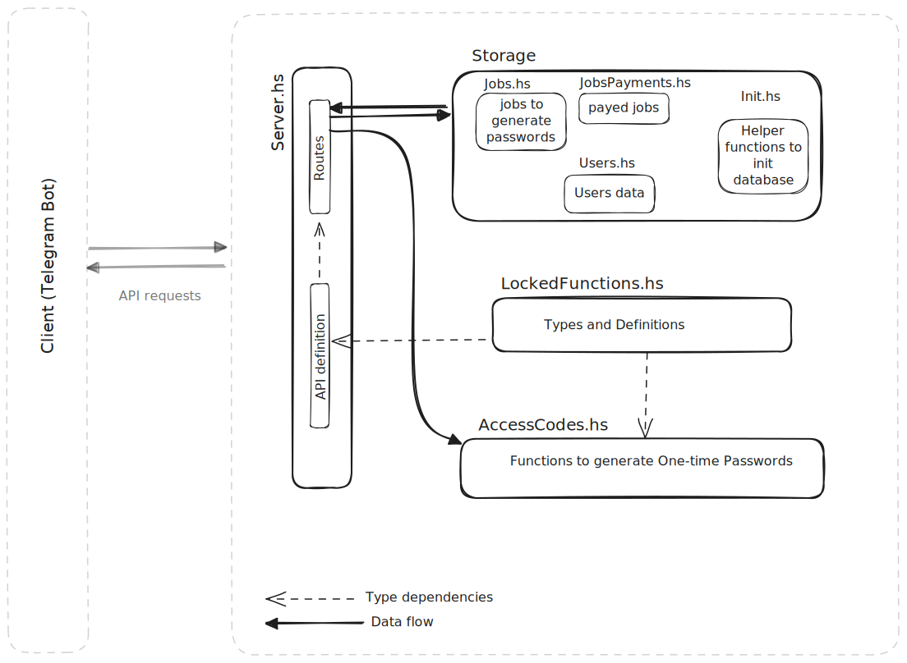

>###### Caution!!!: A pet project! It was created for purposes to practice at coding in Haskell language. Architecture decisions are dead simple. Don't use it as reference for good coding practices.

### jlr-sdd-service

This web server provides APIs to generate one-time passwords. These passwords are used to unlock various engineering functions in JLR SDD software.

#### Build

`cabal build`

#### Run

`cabal run`

Service should be accessible on `http://localhost:3000`
